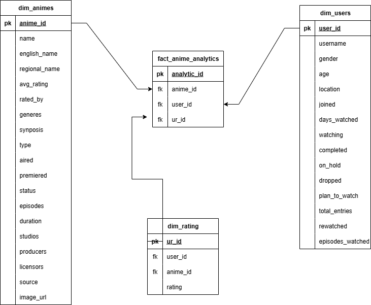

# 📊 anime_analytics

A dbt project to analyze anime performance using data from MyAnimeList. The goal is to identify the best-performing anime titles and uncover key characteristics—such as genres, ratings, and user engagement metrics—that contribute to their success.

---

## 🔍 Project Objective

Determine the best-performing anime and analyze the attributes that influence their popularity and rating, using analytics engineering practices in dbt.

---

## 🗂️ Dataset

The data is sourced from [Kaggle - MyAnimeList Dataset](https://www.kaggle.com/datasets/dbdmobile/myanimelist-dataset), which includes:

- **`animes`**: Anime details (title, type, score, genres, etc.)
- **`users_details`**: User profile data (username, gender, birthday, etc.)
- **`users_score`**: Anime ratings provided by users

---

## 🏗️ Project Architecture

The project uses a modular structure aligned with dbt best practices:

### 1. Staging Layer
- Cleans and standardizes raw data
- Handles type casting, nulls, and formatting

### 2. Intermediate Layer
- Combines datasets and calculates useful fields (e.g., age, engagement metrics)

### 3. Marts Layer
- Final fact and dimension tables used for analytics
- Supports reporting and performance analysis

---

## 📘 Project Documentation

The full dbt documentation is available here:  
👉 [View Docs](https://ramnaresh-ahi.github.io/anime_analytics/)

---

## 📊 Dimensional Model



---

## 🛠️ Tech Stack

- **dbt Cloud** (Developer plan)
- **Snowflake** (data warehouse)
- **GitHub** (version control)

> _Note: A BI tool is not currently in use. This may be added in future iterations._

---

## 📈 Key Analysis Goals

- Identify the most popular and highly rated anime
- Analyze patterns by genre, rating, and audience demographics
- Explore user behavior and rating trends

---

## 🧪 Testing & Documentation

- dbt tests implemented to ensure data quality:
  - `not_null`
  - `unique`
  - `accepted_values`
- Documentation and lineage generated using `dbt docs generate`
- Source freshness tracking and schema.yml documentation used in staging layer

---

## 🚀 Future Enhancements

- Connect to a BI tool like Tableau or Power BI
- Add advanced analytics such as user clustering or time-series trends
- Monitor anime popularity over time
- Add alerts or data tests for new data quality issues

---

## 📁 Folder Structure

```text
anime_analytics/
├── models/
│   ├── staging/
│   ├── intermediate/
│   └── marts/
├── macros/
│   └── custom_schemas.sql
├── snapshots/
├── seeds/
├── analyses/
├── README.md
